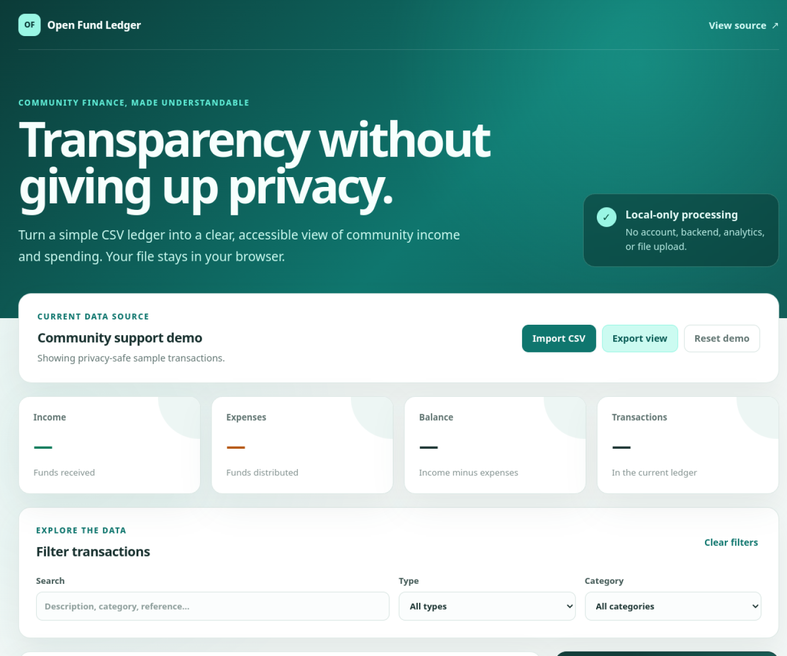

# Open Fund Ledger

A privacy-first, open-source transparency dashboard for volunteer groups,
community funds, and small nonprofit initiatives.

**[Open the live demo](https://19120294.github.io/open-fund-ledger/)** ·
**[Download sample CSV](public/sample-ledger.csv)** ·
**[View the roadmap](ROADMAP.md)**

Open Fund Ledger turns a simple CSV file into a clear public view of income,
expenses, balance, categories, and transaction details. Everything runs in the
browser: imported data is never uploaded to a server.

## Why this exists

Small community groups often need transparency without the cost and complexity
of accounting software. A spreadsheet is easy to maintain, but difficult for
supporters to explore. Open Fund Ledger provides a friendly, accessible layer
on top of that spreadsheet while keeping the source data portable.

This project is a transparency aid, not certified accounting or audit software.

## Features

- Import a local CSV ledger without sending data anywhere.
- Review income, expenses, balance, and transaction count.
- Search and filter by transaction type or category.
- See an expense breakdown without a charting dependency.
- Export the currently filtered view back to CSV.
- Use the interface with a keyboard, screen reader, phone, or desktop.
- Start immediately with privacy-safe demo data and a CSV template.
- Verify every contribution through automated tests, type checking, and builds.

## Try it in one minute

1. Open the [live demo](https://19120294.github.io/open-fund-ledger/).
2. Explore the built-in synthetic ledger.
3. Download [the sample ledger](public/sample-ledger.csv) and edit a copy.
4. Select **Import CSV**. Processing stays in your current browser tab.
5. Filter the view and export only the visible transactions if needed.

## CSV format

The first row must use these headers:

~~~csv
id,date,type,category,description,amount,reference
~~~

| Field | Required | Rules |
| --- | --- | --- |
| <code>id</code> | Yes | Unique value for the transaction |
| <code>date</code> | Yes | ISO date in YYYY-MM-DD format |
| <code>type</code> | Yes | <code>income</code> or <code>expense</code> |
| <code>category</code> | Yes | Human-readable grouping |
| <code>description</code> | Yes | Public transaction description |
| <code>amount</code> | Yes | Positive number without a currency symbol |
| <code>reference</code> | No | Receipt, campaign, or public reference |

The MVP displays amounts as Vietnamese đồng (VND). Do not mix currencies in a
single ledger. Imported files have a 2 MB safety limit.

Never publish donor identities, bank details, private receipt links, or other
personal information without explicit permission.

## Local development

Requirements: Node.js 22 or later.

~~~bash
npm install
npm run dev
~~~

Quality checks:

~~~bash
npm run typecheck
npm test
npm run build
~~~

## Publish your own ledger

1. Fork this repository.
2. Replace <code>public/sample-ledger.csv</code> with privacy-safe public data.
3. Enable GitHub Pages with **GitHub Actions** as the source.
4. Merge to <code>main</code>; the deployment workflow publishes the site.

For recurring publication, keep private donor details outside the public CSV.
Use anonymous references when identity disclosure is not explicitly permitted.

## Roadmap and contributing

The public [roadmap](ROADMAP.md) links every planned outcome to a GitHub issue.
A documentation-sized [good first issue](https://github.com/19120294/open-fund-ledger/issues/8)
is available for new contributors.

Community contributions are welcome. Read [CONTRIBUTING.md](CONTRIBUTING.md)
before opening a pull request. Please report security or privacy concerns using
[SECURITY.md](SECURITY.md).

Maintainers can reuse the ready-to-edit [community launch copy](docs/launch-post.md)
when introducing the project to relevant nonprofit and open-source groups.

## Project principles

- **Privacy by default:** no backend, trackers, accounts, or silent persistence.
- **Portable data:** CSV remains the source of truth.
- **Accessible information:** key numbers never rely on color alone.
- **Honest scope:** no claims of bookkeeping, tax, or audit compliance.
- **Low maintenance:** minimal runtime dependencies and a static deployment.

## License

[MIT](LICENSE)
